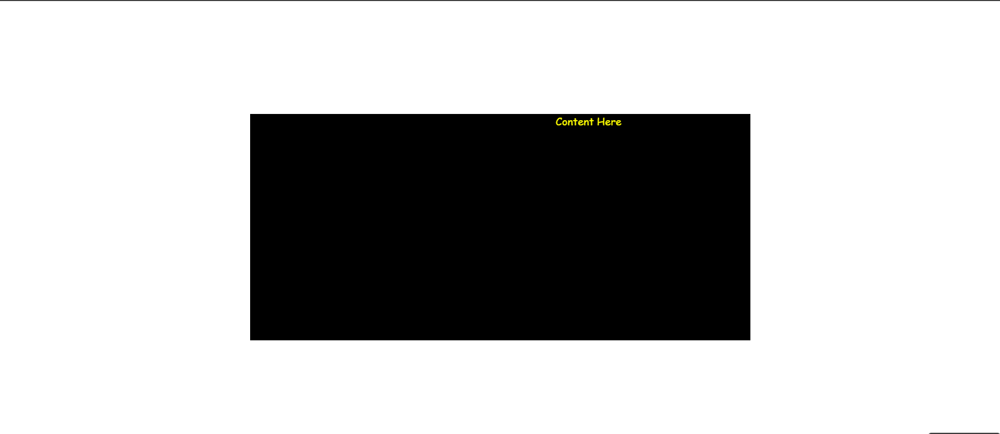
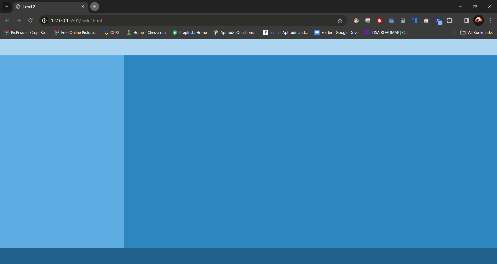
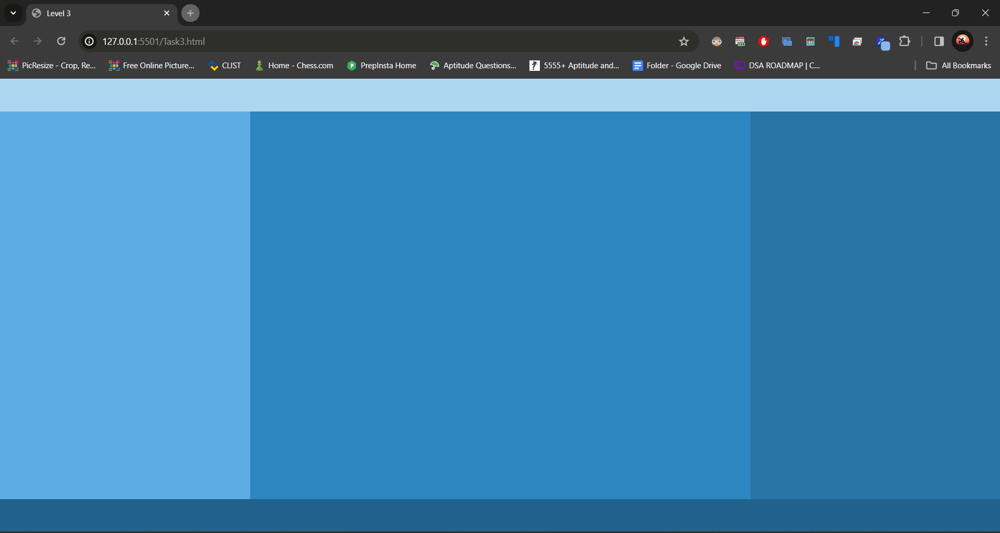
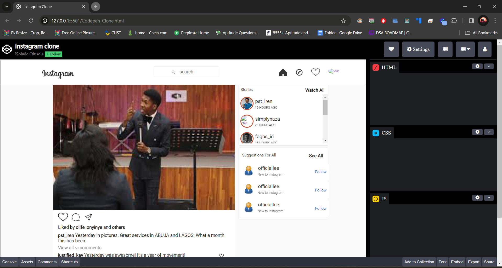
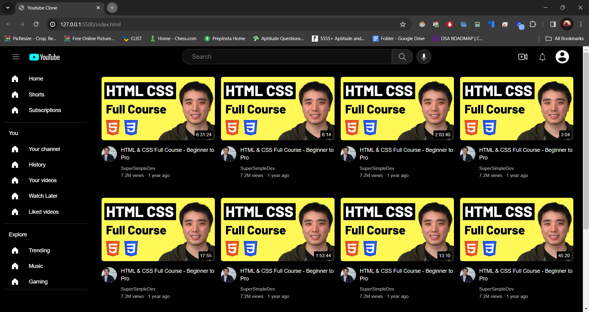

2024-02-06 Contains Progress of the Traning Period.

# HTML-CSS Tasks

## Task 1: Level 1

File: `task1.html`

Description: 
- Simple webpage with a centred black square containing text scrolling horizontally.

## Task 2: Level 2

File: `task2.html`

Description: 
- Webpage with header, footer, and two coloured divs, one on the left and one on the right, filling 25% and 75% of the viewport width respectively.

## Task 3: Level 3

File: `task3.html`

Description: 
- Enhanced version with a header, footer, and three coloured divs, filling 25%, 50%, and 25% of the viewport width respectively, demonstrating a more complex layout.

## CodePen Clone

File: `codepen_clone.html`

Description:
- A clone of CodePen, featuring a header with profile information and buttons, an iframe displaying an Instagram clone, a sidebar with HTML, CSS, and JS boxes, and a footer with additional options.

## YouTube Clone

File: `youtube_clone.html`

Description:
- This project is a simple HTML file that resembles YouTube. It features a header for search and navigation, a sidebar with links, and a main area displaying video previews, including thumbnails, channel info, and video stats.

